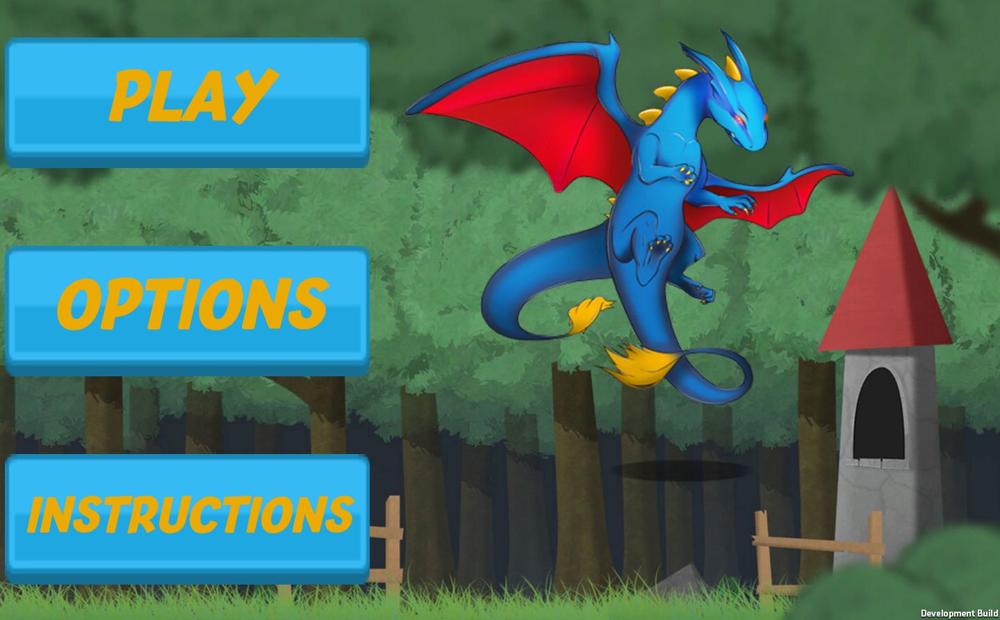
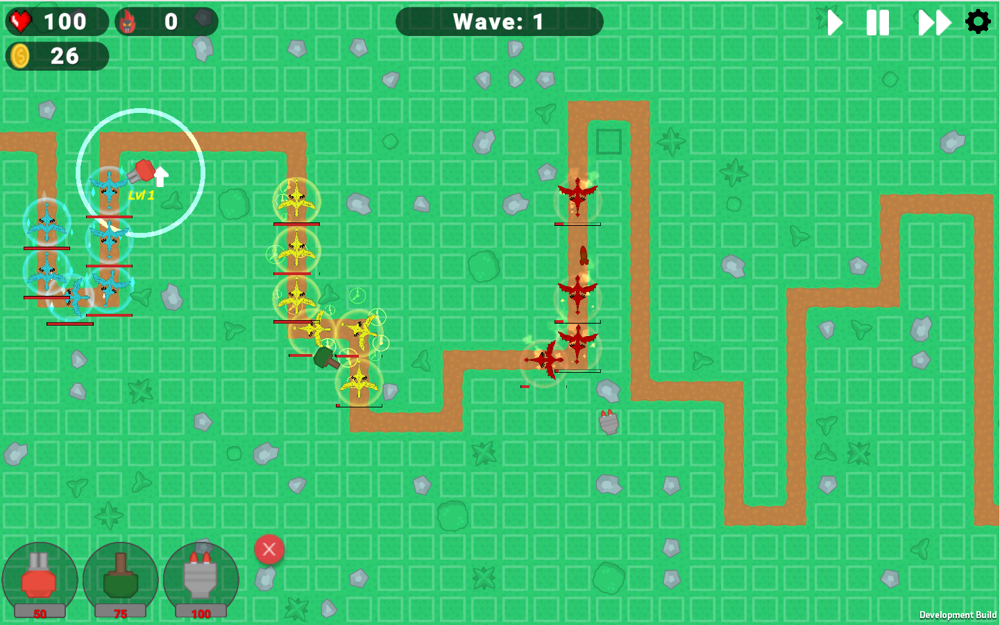

# BlueDragonsGame

 

  

  <h2 align="center">Blue Dragons</h2>
  <h3 align="center">A Tower Defense Game for Android.</h4>

  

    Defend your castle from the attacking dragons! 
     
    <a href="https://github.com/cdunham927/BlueDragonsGame"><strong>Explore the docs »</strong></a>
     
     
    <a href="https://melissaappel.itch.io/dragon-defense-frenzy">Play the Game</a>
    
  

<!-- TABLE OF CONTENTS -->

  
Table of Contents

  <ol>
    <li>
      <a href="#about-the-project">About The Project</a>
      <ul>
        <li><a href="#built-with">Built With</a></li>
      </ul>
    </li>
    <li>
      <a href="#getting-started">Getting Started</a>
      <ul>
        <li><a href="#installation">Installation</a></li>
      </ul>
    </li>
    <li><a href="#usage">Gameplay Screenshots</a></li>
  </ol>

<!-- ABOUT THE PROJECT -->
## About The Project
A basic tower defense game written in C# and for use on android mobile devices. The game consists of 3 levels, each with increasing difficulty in which players must prevent the onslaught of dragons spawning from reaching the end of the map. Players will start off with a small amount of money to purchase towers to defend themselves against the dragons, and will earn money as they attack enemies. Each level requires players to adapt a unique strategy to utilize their funds to purchase and upgrade towers that will defeat spawns of enemy dragons as well as the boss dragon at the end of each level. 

Towers:
* Standard tower that shoots one bullet at a time and deals moderate amounts of damage. Can be upgraded to increase range and damage, as well as adding a burn status effect to enemy dragons, dealing damage over time.
* Bomb Tower which deals a low amount of damage to enemies within a certain splash range. Can be upgraded to increase range and damage, as well as adding a slow down status effect to enemy dragons. 
* Honing missile tower which shoots slowly, but tracks and follows enemies and deals large amounts of damage. Can be upgraded to increase range and damage, as well as adding a freeze status effect to enemies which temporarily prevents them from moving. 

Dragons:
* Based on their colors, dragons will be resistant to different tower status effects. 

### Built With

* [Unity](https://unity.com/)
* [itch.io](https://itch.io/)

<!-- GETTING STARTED -->
## Getting Started
Application can be built in Unity for Android deployment, however github version so far only contains access to web game. <a href="https://melissaappel.itch.io/dragon-defense-frenzy">Play the Game</a>

### Installation

1. No installation required, just click <a href="https://melissaappel.itch.io/dragon-defense-frenzy">here</a> to play game in your web browser.

<!-- USAGE EXAMPLES -->
## Screenshots from Game

 

